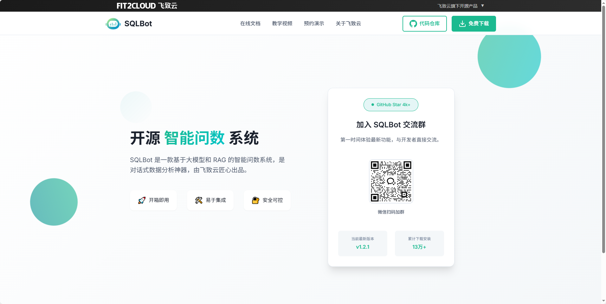
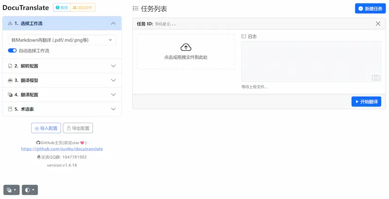
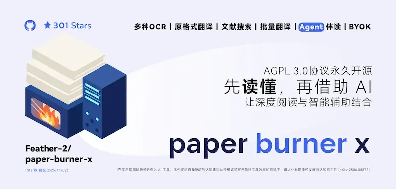
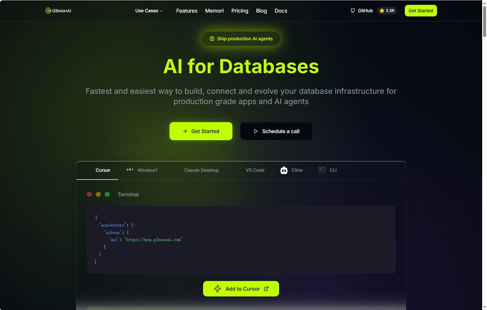

## [SQLBot](https://github.com/dataease/SQLBot)

SQLBot 是一款基于大模型和 RAG 的智能问数系统。SQLBot 的优势包括：

开箱即用: 只需配置大模型和数据源即可开启问数之旅，通过大模型和 RAG 的结合来实现高质量的 text2sql；
易于集成: 支持快速嵌入到第三方业务系统，也支持被 n8n、MaxKB、Dify、Coze 等 AI 应用开发平台集成调用，让各类应用快速拥有智能问数能力；
安全可控: 提供基于工作空间的资源隔离机制，能够实现细粒度的数据权限控制。

地址：https://github.com/dataease/SQLBot

## [docutranslate](https://github.com/xunbu/docutranslate)

一个 Python 写的 Web 工具，通过 AI 模型翻译各种格式的文档文件。

地址：https://github.com/xunbu/docutranslate

## [paper-burner-x](https://github.com/Feather-2/paper-burner-x)

Paper Burner X - 浏览器即开即用，AI文献识别、文档批量翻译、阅读与智能分析工具 丨BYOK, 基于 Paper Burner

地址：https://github.com/Feather-2/paper-burner-x

## [Affinity](https://www.affinity.studio/)

用于图像编辑的桌面软件，Photoshop 的替代品，被 Canva 公司收购后，现在可以免费下载使用。

地址：https://www.affinity.studio/

## [Memori](https://github.com/GibsonAI/memori)

“Neon”是 Memori 支持的 SQL 数据库之一，用于存储大型语言模型（LLM）的记忆数据。

地址：https://github.com/GibsonAI/memori