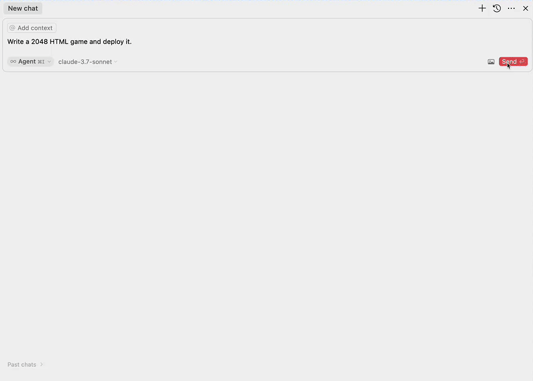
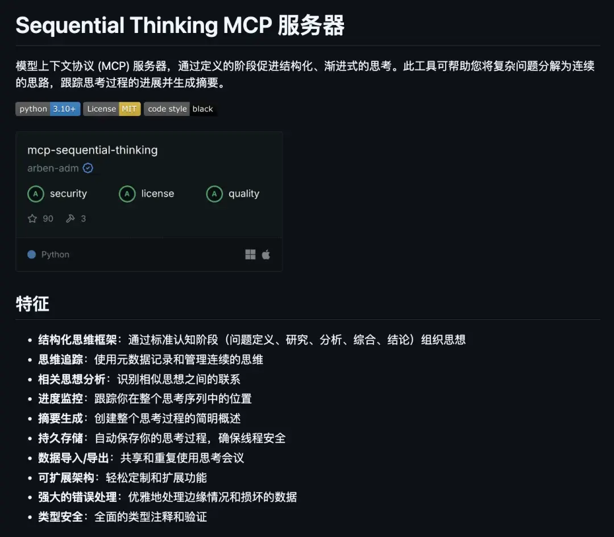
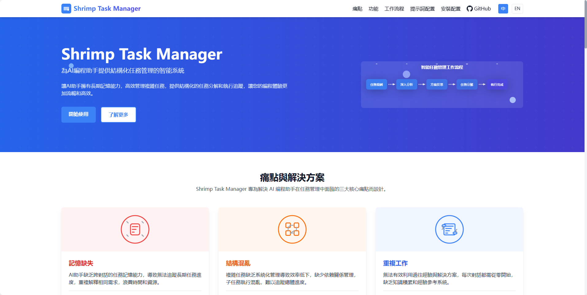

## [fastapi_mcp](https://github.com/tadata-org/fastapi_mcp)

FastAPI-MCP 是一个工具库，可以轻松将你的 FastAPI 接口转换成符合 Model Context Protocol (MCP) 标准的工具，并自带认证功能。它直接集成到 FastAPI 应用中，无需复杂配置，保留原有的请求/响应模型结构和文档，支持灵活部署。适合想快速为现有 FastAPI 服务添加 MCP 兼容能力的开发者，同时提供托管方案选项。

地址：https://github.com/tadata-org/fastapi_mcp

## [edgeone-pages-mcp](https://github.com/TencentEdgeOne/edgeone-pages-mcp)

腾讯开源的 EdgeOne Pages MCP 它能将 HTML 内容、文件夹和 zip 文件部署到 EdgeOne Pages ，丢给一个可公开访问的 URL链接。

地址：https://github.com/TencentEdgeOne/edgeone-pages-mcp

## [mcp-chrome](https://github.com/hangwin/mcp-chrome?tab=readme-ov-file)

Chrome MCP Server 是一个基于chrome插件的 模型上下文协议 (MCP) 服务器，它将您的 Chrome 浏览器功能暴露给 Claude 等 AI 助手，实现复杂的浏览器自动化、内容分析和语义搜索等。与传统的浏览器自动化工具（如playwright）不同，Chrome MCP server直接使用您日常使用的chrome浏览器，基于现有的用户习惯和配置、登录态，让各种大模型或者各种chatbot都可以接管你的浏览器，真正成为你的如常助手

地址：https://github.com/hangwin/mcp-chrome?tab=readme-ov-file

## [firecrawl-mcp-server](https://github.com/mendableai/firecrawl-mcp-server?tab=readme-ov-file)

把复杂的网页抓取封装成 AI 能直接调用的工具包：单页提取、批量爬取、全网搜索、深度抓取、结构化提取五大功能一键集成，连 JavaScript 渲染页面都能搞定。

地址：https://github.com/mendableai/firecrawl-mcp-server

## [mcp-sequential-thinking](https://github.com/arben-adm/mcp-sequential-thinking)

这个 MCP 能让 AI 把思考过程拆分成清晰的步骤，让思路更有条理。

地址：https://github.com/arben-adm/mcp-sequential-thinking

## [mcp-shrimp-task-manager](https://github.com/cjo4m06/mcp-shrimp-task-manager)

Shrimp Task Manager 像一位 AI 的“项目经理”，能帮 AI 把复杂任务拆解成可执行的小步骤，管理执行顺序和依赖关系。

地址：https://github.com/cjo4m06/mcp-shrimp-task-manager

