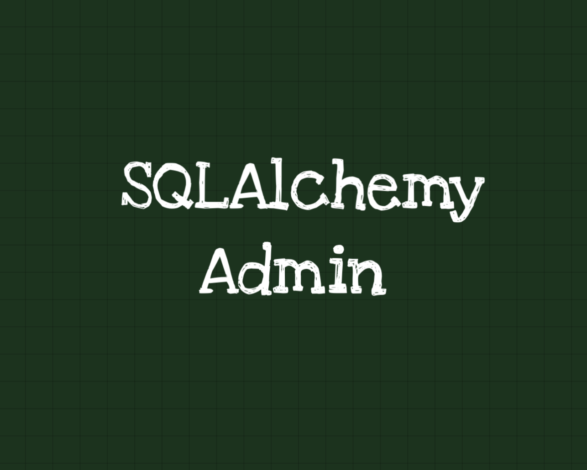

## [sqladmin](https://github.com/aminalaee/sqladmin)

SQLAdmin，全称 SQLAlchemy Admin for Starlette/FastAPI，是基于 SQLAlchemy 的 Admin 管理面板，专门给 Starlette/FastAPI 量身打造的。
简单说，它帮你：

• 自动生成列表/详情/编辑/删除页
• 支持同步/异步数据库引擎
• 用 Tabler 风格 UI，美观大方
• 兼容 WTForms 和 SQLModel

地址：https://github.com/aminalaee/sqladmin