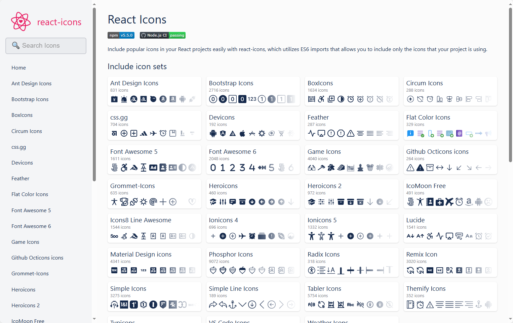
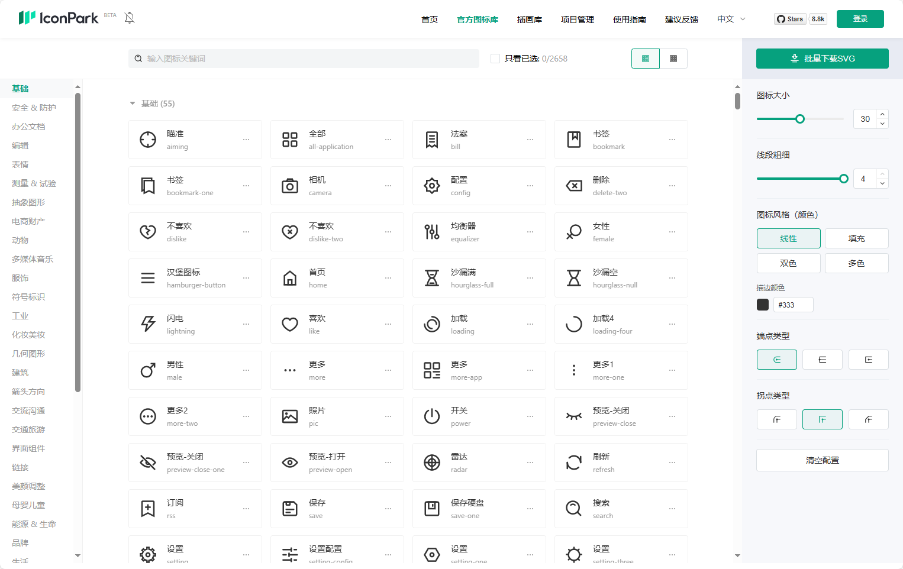
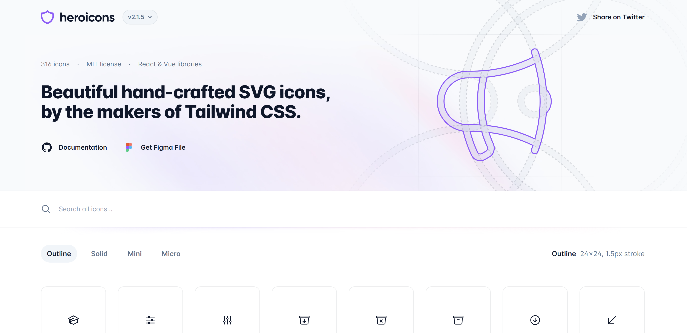
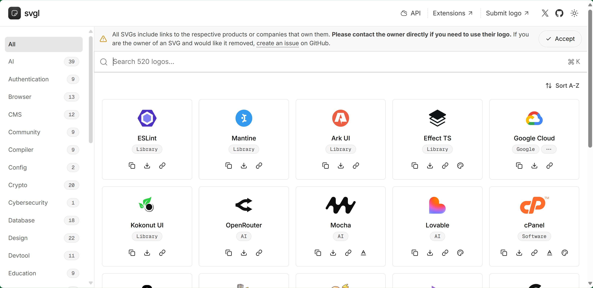
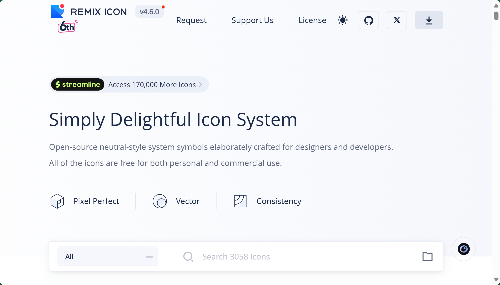
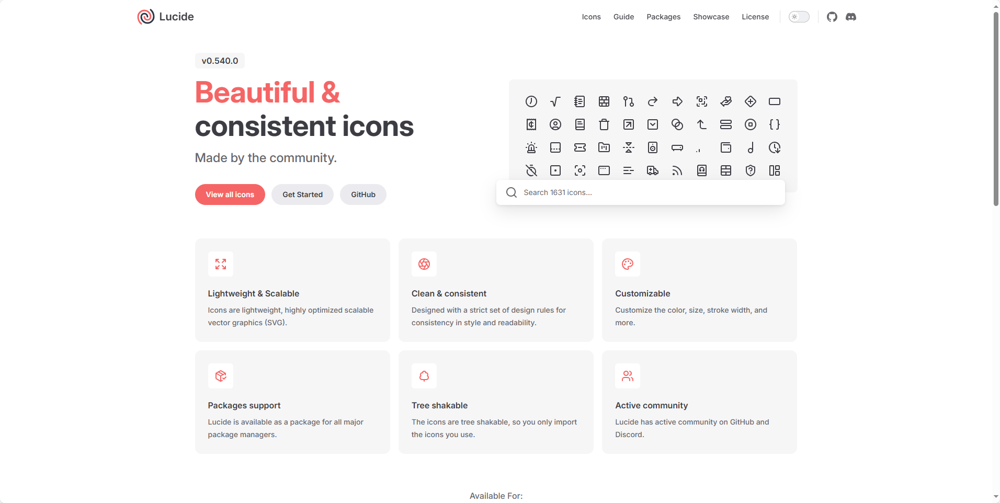

### [React Icons](https://react-icons.github.io/react-icons/)

- React Icons 是一个便捷的图标库，将流行的图标集整合进 React 项目。
- 采用 ES6 模块导入，可以按需加载，减少打包体积。
- 包含超过 40 个主流图标集，涵盖设计、开发、社交等场景。

地址：https://react-icons.github.io/react-icons/

### [IconPark](https://iconpark.oceanengine.com/official)

- IconPark 是由字节跳动推出的图标库平台，提供海量免费 SVG 图标资源，支持灵活自定义样式。
- 图标覆盖 2658+ 个图标，包含丰富分类，适用于产品设计、Web 开发、移动 App 等场景。

地址：https://iconpark.oceanengine.com/official

### [heroicons](https://heroicons.com/)

Heroicons 是一套简单直接的高品质图标库，由大名鼎鼎的前端框架 Tailwind CSS 的团队制作并且发布。接触过 Tailwind CSS 的开发者可能也注意到，Tailwind CSS 生态里的前端 UI 组件质量都很不错，当然这套图标库也一样。

地址：https://heroicons.com/

## [svgl](https://svgl.app/)

地址：https://svgl.app/

## [remixicon](https://remixicon.com/)

地址：https://remixicon.com/

## [lucide](https://lucide.dev/)

地址：https://lucide.dev/