## [React Icons](https://mui.com/)
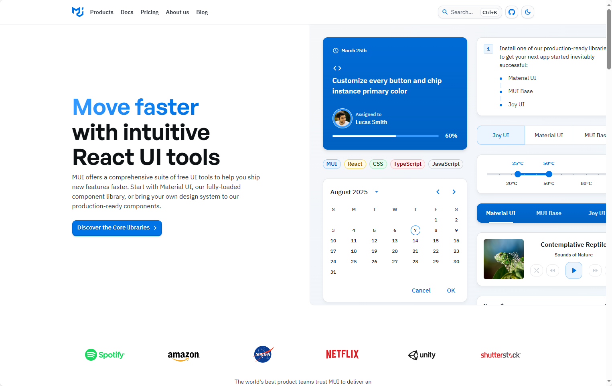


### 🌟 什么是 MUI？
- **MUI（Material UI）** 是一个功能强大的 React UI 组件库，帮助开发者快速构建美观、可定制的 Web 应用界面。
- 提供多个子库，包括：
  - **Material UI**：基于 Google Material Design 的核心组件库
  - **MUI Base**：无样式基础组件，适合自定义设计系统
  - **Joy UI**：现代美学风格组件
  - **MUI X**：高级组件（如数据表格、日历等）
  - **Toolpad**：用于构建内部工具和仪表盘的组件和工具（Beta）

---

地址：https://mui.com/


## [HeadlessUI](https://headlessui.com/)

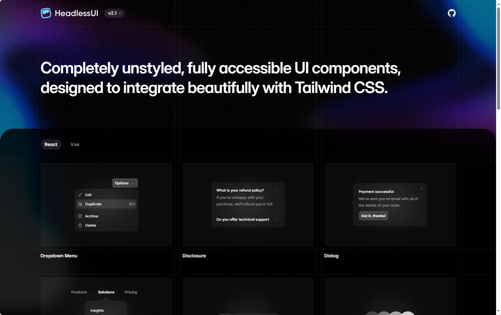


### 🧩 项目简介：Headless UI
- **Headless UI** 是一组完全无样式但具备完整可访问性的 UI 组件。
- 由 **Tailwind Labs** 开发，专为与 **Tailwind CSS** 搭配使用而设计。
- 支持 **React** 和 **Vue** 框架。

---

### 🎯 核心特点
- **无样式设计**：组件不包含任何默认样式，开发者可完全控制外观。
- **可访问性优先**：每个组件都遵循 WAI-ARIA 标准，确保对所有用户友好。
- **组件灵活**：适合构建高度定制化的 UI，而不受预设样式限制。

---


### 📦 使用场景
- 构建自定义设计系统
- 与 Tailwind CSS 深度集成
- 需要高度可访问性但不希望被样式限制的项目

地址：https://headlessui.com/

## [HeroUI](https://www.heroui.com/)

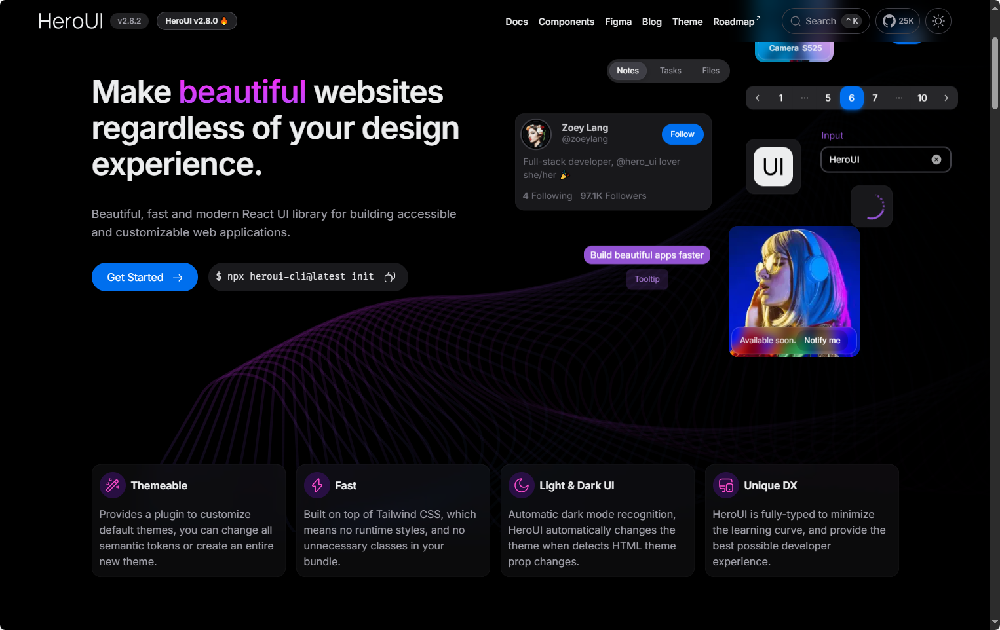

### 🌟 项目简介：HeroUI（前身为 NextUI）
- **HeroUI** 是一个现代化、快速且美观的 React UI 组件库。
- 适用于构建可访问性强、可定制的 Web 应用。
- 基于 **Tailwind CSS**，无运行时样式，体积轻巧。

---

### 🚀 核心优势
- **无样式冲突**：使用 Tailwind Variants，避免类名冲突。
- **自动暗黑模式**：根据 HTML 属性自动切换主题。
- **完全类型化**：TypeScript 支持，提升开发体验。
- **可访问性优先**：基于 React Aria，支持键盘导航、屏幕阅读器等。
- **组件多样**：提供 210+ 响应式组件模板（HeroUI Pro）。
- **Next.js 支持**：兼容新版本的 app/ 目录结构。

---

### 🎨 主题与定制
- 提供 Tailwind 插件，可自定义主题色彩与语义 token。
- 支持 light/dark 模式的独立配置：
  ```js
  const { heroui } = require("@heroui/react");
  module.exports = {
    plugins: [
      heroui({
        themes: {
          light: { colors: { primary: "#0072f5" } },
          dark: { colors: { primary: "#0072f5" } },
        },
      }),
    ],
  };
  ```

---


### 📦 快速开始命令
```bash
npx heroui-cli@latest init
```


地址： https://www.heroui.com/

## [gestalt](https://gestalt.pinterest.systems/home)

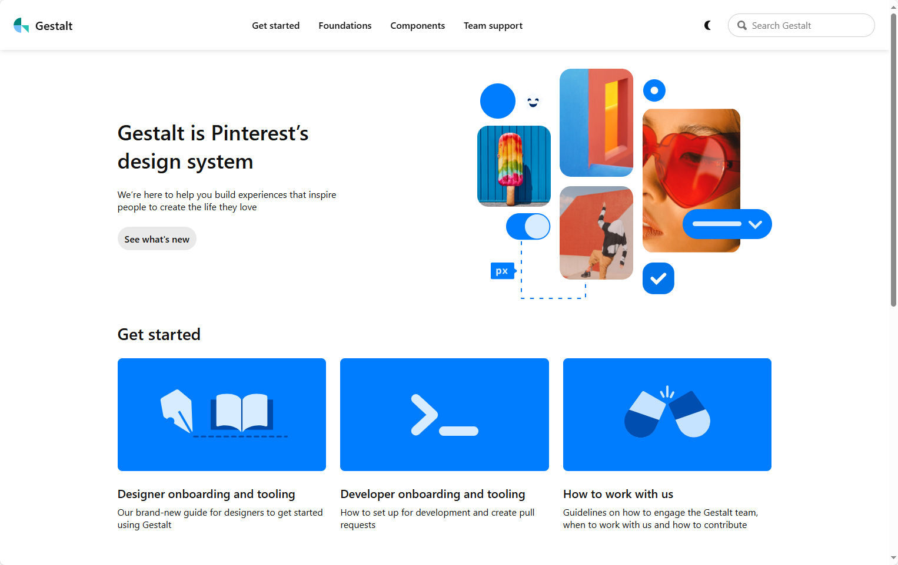

### 🎨 什么是 Gestalt？
- **Gestalt** 是 Pinterest 官方推出的设计系统。
- 旨在帮助设计师和开发者构建激发用户灵感的产品体验。
- 提供统一的 UI 组件、设计规范和工具资源。

---

地址：https://gestalt.pinterest.systems/home

## [shadcn](https://ui.shadcn.com/)

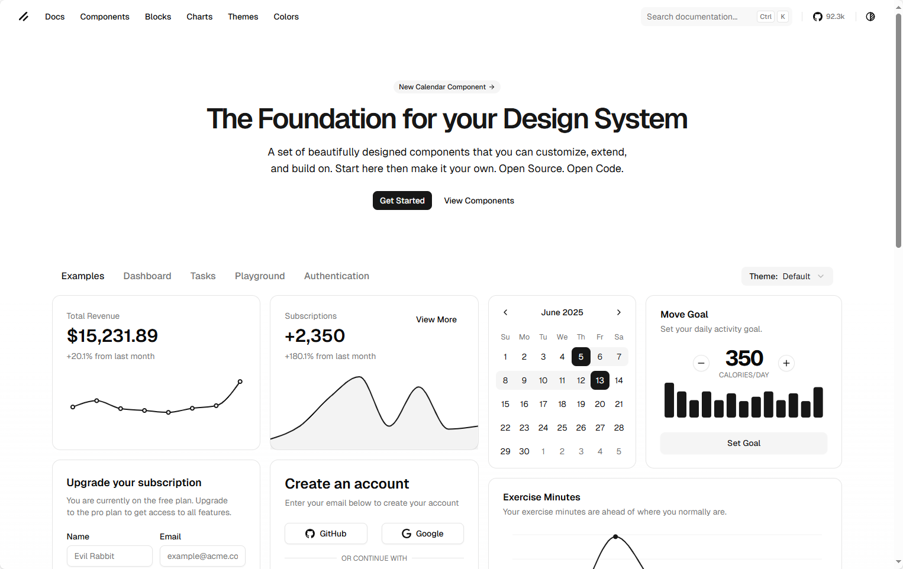

### 🧱 项目简介：shadcn/ui
- **shadcn/ui** 是一个开源的 React 组件库，强调设计系统的可扩展性与可定制性。
- 提供一套美观、实用的 UI 组件，适合构建现代 Web 应用。
- 设计理念是：**“Start here, then make it your own.”**

---

### 🎯 核心特点
- **开源代码**：所有组件均可查看源代码并自由修改。
- **可定制性强**：组件结构清晰，支持 Tailwind CSS 和多种主题配置。
- **组件丰富**：涵盖表单、仪表盘、认证、图表、日历等常用 UI 模块。
- **设计系统基础**：适合构建自己的 UI 体系或产品组件库。

---

地址：https://ui.shadcn.com/

## [React Aria](https://react-spectrum.adobe.com/react-aria/index.html)

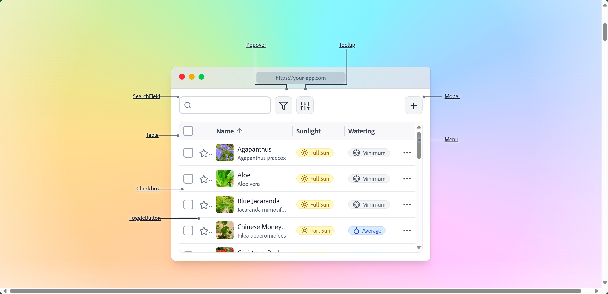


### 🎯 项目简介：React Aria
- **React Aria** 是 Adobe 推出的一个无样式、可访问性优先的 React 组件库。
- 提供超过 50 个组件，具备内建行为、响应式交互、国际化支持。
- 适用于构建自定义设计系统或高度定制的 Web 应用。

---

### 🧩 核心特点
- **无样式设计**：完全不绑定样式，开发者可自由使用 Tailwind、Vanilla CSS、Styled Components 等。
- **组件结构清晰**：每个组件由多个部分组成，支持 render props、slots、状态管理。
- **可访问性保障**：符合 WAI-ARIA 标准，支持键盘导航、屏幕阅读器等。
- **国际化支持**：内建多语言适配能力。

---


地址：https://react-spectrum.adobe.com/react-aria/index.html

## [Skiper UI](https://skiper-ui.com/)
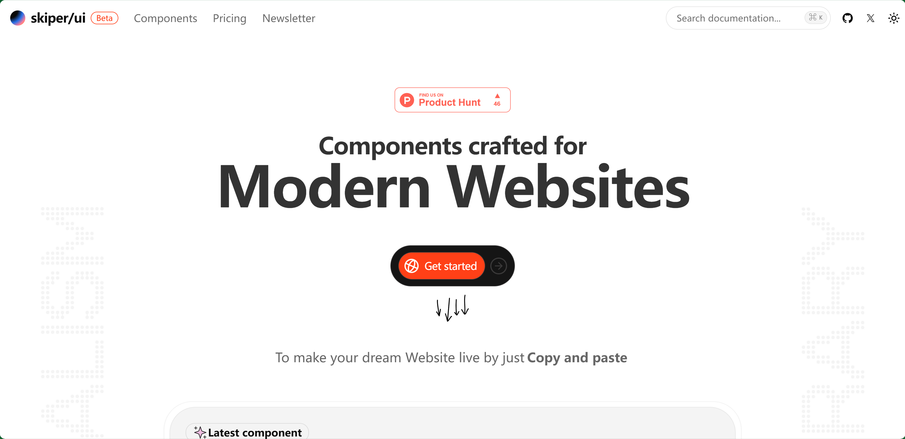

Skiper UI(https://skiper-ui.com/)提供了一系列现代，简约的组件，该组件由CSS，Next.js和React构建。该库提供了副本组件，包括着陆页模板，投资组合设计以及具有Supabase Integration的全栈模板。功能包括制定运动动画，响应式设计。

地址：https://skiper-ui.com/

## [MiroTalk SFU](https://github.com/miroslavpejic85/mirotalksfu)


基于浏览器 WebRTC 的在线视频通信开源解决方案，链接是多人视频会议版本，另有点对点通信版本、一对一通信版本。

地址：https://github.com/miroslavpejic85/mirotalksfu

## [react](https://github.com/untitleduico/react)

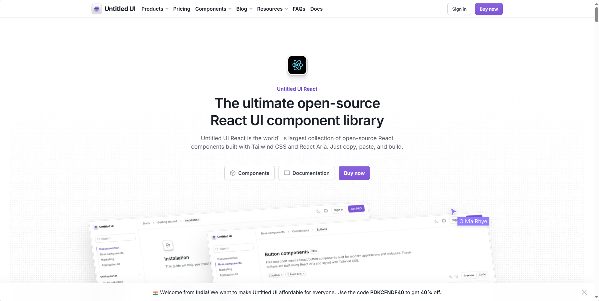

全球最大的开源 React 组件库，基于 Tailwind CSS 和 React Aria 构建

地址：https://github.com/untitleduico/react

## [Kibo UI](https://www.kibo-ui.com/)

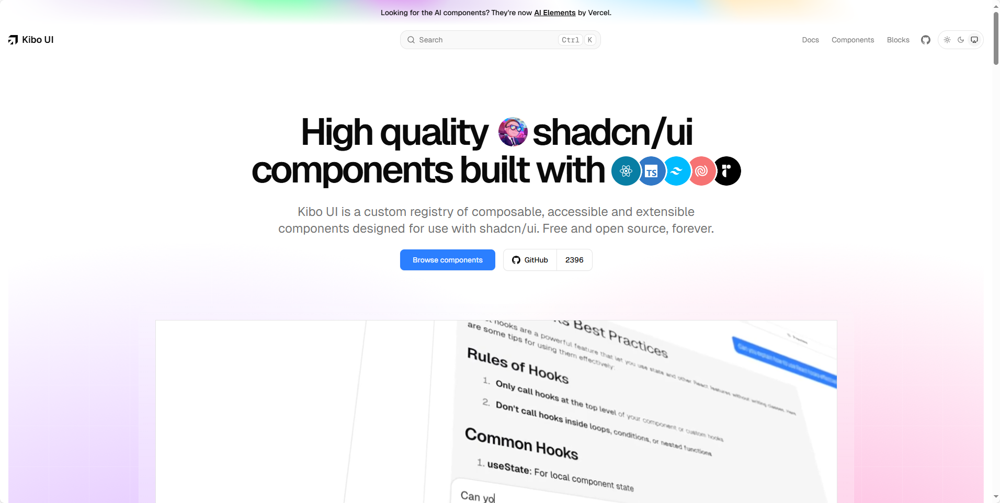

Kibo UI（https://www.kibo-ui.com/）是一个可自定义的注册表，该注册表是可与ShadCN/UI一起使用的可组合，可访问和开源组件。

地址：https://www.kibo-ui.com/

## [Nurui](https://github.com/afsar-dev/Nurui)

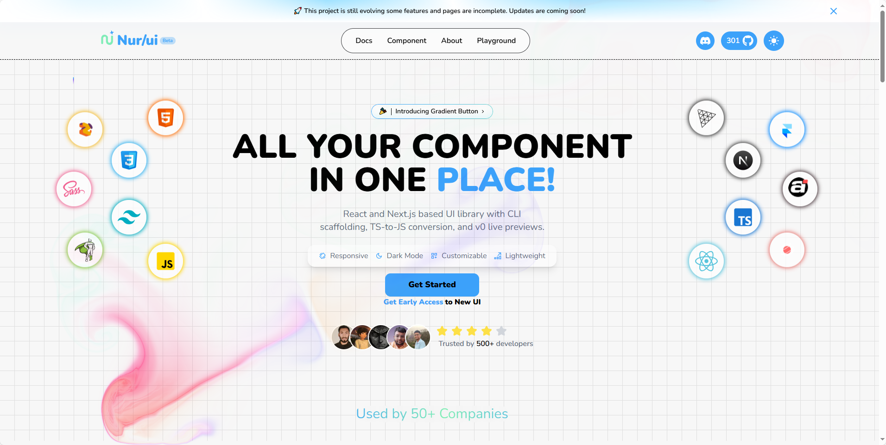

Nurui 是一个基于 React 和 Next.js 的现代化 UI 组件库,旨在简化前端开发。它提供了 CLI 脚手架、自动将 TypeScript 转换为 JavaScript 的功能,以及实时组件预览,为开发人员提供了更快捷、更可定制的工作流程。

地址: https://github.com/afsar-dev/Nurui

## [ReUI](https://reui.io/)

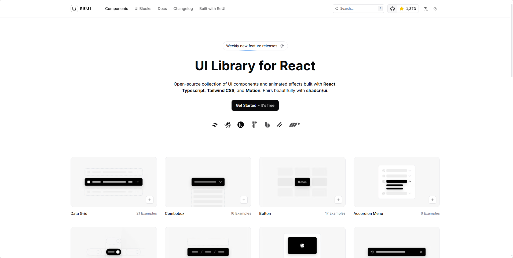

ReUI 是一个开源的 UI 组件和动画效果集合,使用 React、TypeScript、Tailwind CSS 和 Motion 构建。它与 shadcn/ui 完美配合。

地址：https://reui.io/

## [Headless UI](https://headlessui.com/v1)

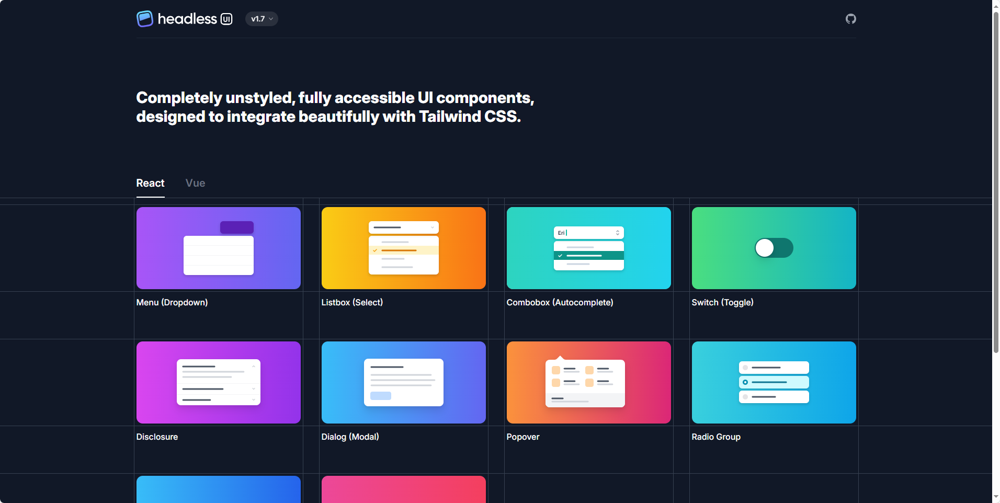

Completely unstyled, fully accessible UI components, designed to integrate beautifully with Tailwind CSS.

地址：https://headlessui.com/v1