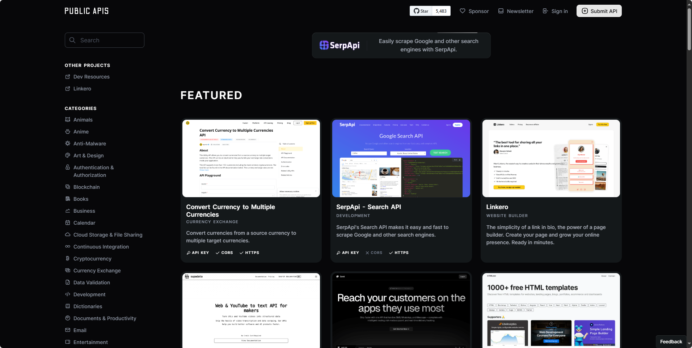

## [60s](https://github.com/vikiboss/60s)

60s：每日 60 秒资讯 API 集合。该项目集合了包括每日新闻、实时票房、汇率、热搜榜、随机段子等多种数据的 API 服务。

地址: https://github.com/vikiboss/60s

## [public-apis](https://github.com/Marcelscruz/public-apis)

它是一个由社区协作维护的公共 API 列表，专为开发者设计。

地址：https://github.com/marcelscruz/public-apis