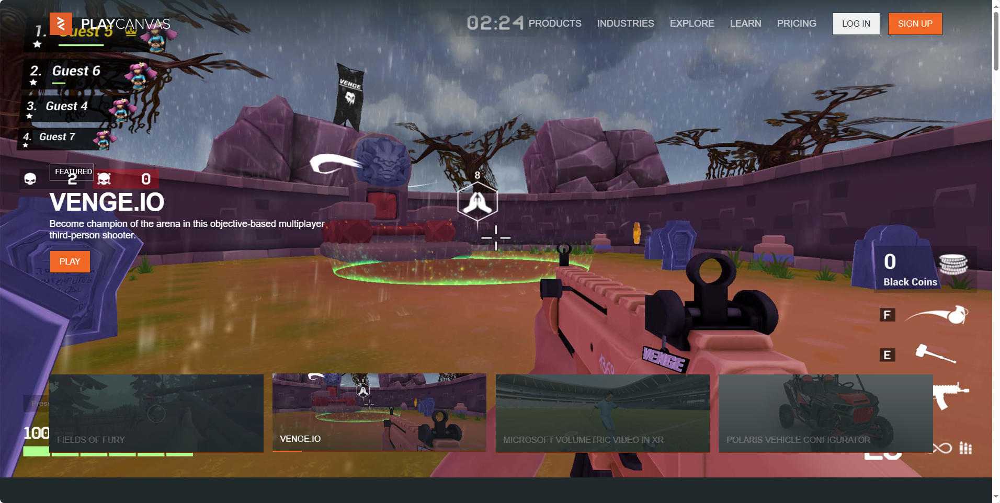

## [playcanvas](https://github.com/playcanvas/engine)

- 核心定位：基于 HTML5 和 WebGL 的开源 3D 引擎，无需插件即可在浏览器运行
- 社区活跃度：星标数超 1.5 万，issue 响应速度平均 3 天（数据源自官方 badge）
- 多语言支持：文档提供中英日韩四种语言，对非英语开发者友好

地址：https://github.com/playcanvas/engine

官网：https://playcanvas.com/explore