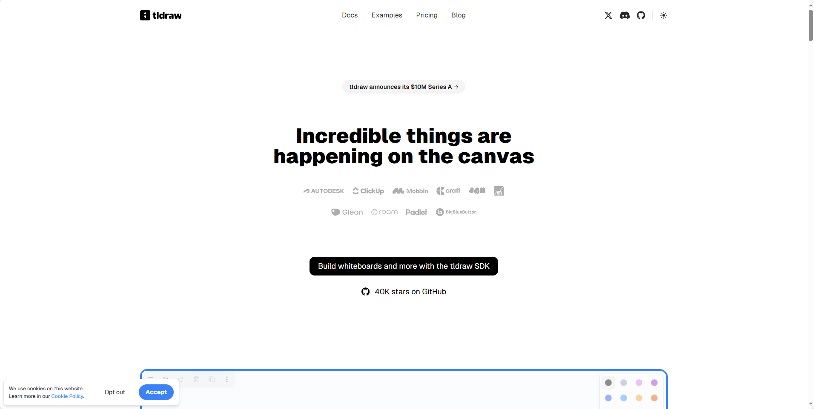

## [tldraw](https://github.com/tldraw/tldraw)

tldraw 是由 tldraw.com[1] 团队维护的开源项目，其核心目标是为开发者提供一个易于集成、功能丰富的无限画布解决方案。该项目自2021年发布以来，已经积累了超过 41,222颗星标，成为 React 生态中备受瞩目的工具之一。

它的主要特性包括：

•支持 多人协作 和实时同步
•提供 丰富的绘图和编辑功能
•可以轻松嵌入到任何 React 应用中
•开发者友好，文档齐全，社区活跃

地址：https://github.com/tldraw/tldraw