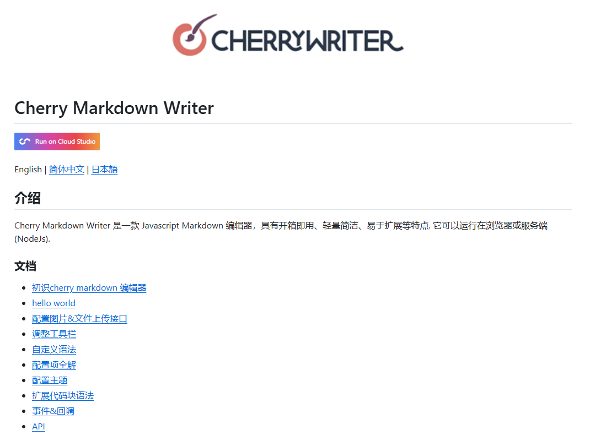
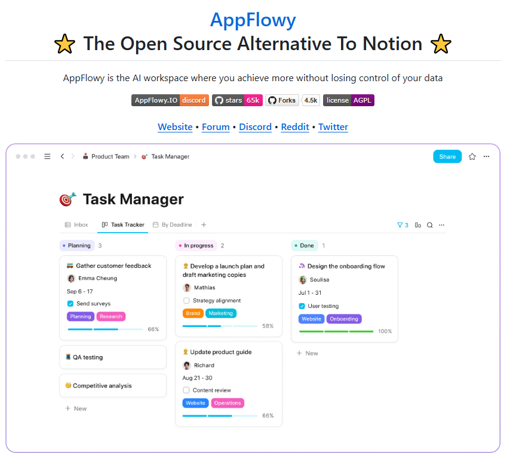

## [gpt4all](https://github.com/nomic-ai/gpt4all)

GPT4All是一个开源项目，让你能在自己的电脑上本地运行各种大语言模型（LLM），不需要联网或高端显卡。它提供了简单易用的桌面应用和Python库，支持多种模型比如Meta的Llama 3，还能让你用本地文档聊天。适合想隐私保护或离线使用AI功能的用户，Windows、Mac和Linux都能用，连树莓派这类设备也能跑。

地址：https://github.com/nomic-ai/gpt4all

## [NotebookLM](https://notebooklm.google/)

NotebookLM 是由 Google 推出的 AI 研究工具，基于最新的 Gemini 模型，旨在帮助用户更高效地进行研究、学习和创意工作。

地址： https://notebooklm.google/

## [Cherry Markdown Writer](https://github.com/Tencent/cherry-markdown)

Cherry Markdown Writer 是一款 Javascript Markdown 编辑器，具有开箱即用、轻量简洁、易于扩展等特点. 它可以运行在浏览器或服务端(NodeJs).

地址：https://github.com/Tencent/cherry-markdown

## [AppFlowy](https://github.com/AppFlowy-IO/AppFlowy?tab=readme-ov-file)

AppFlowy是一款开源的知识管理和团队协作工具，它被设计为Notion的替代品。通过提供强大的文档编辑、任务管理和团队合作功能，AppFlowy让用户能够在保持数据安全的同时，享受到流畅的工作体验。使用Flutter和Rust开发的它，支持多平台运行，无论是桌面还是移动设备都能完美适配。

地址： https://github.com/AppFlowy-IO/AppFlowy?tab=readme-ov-file