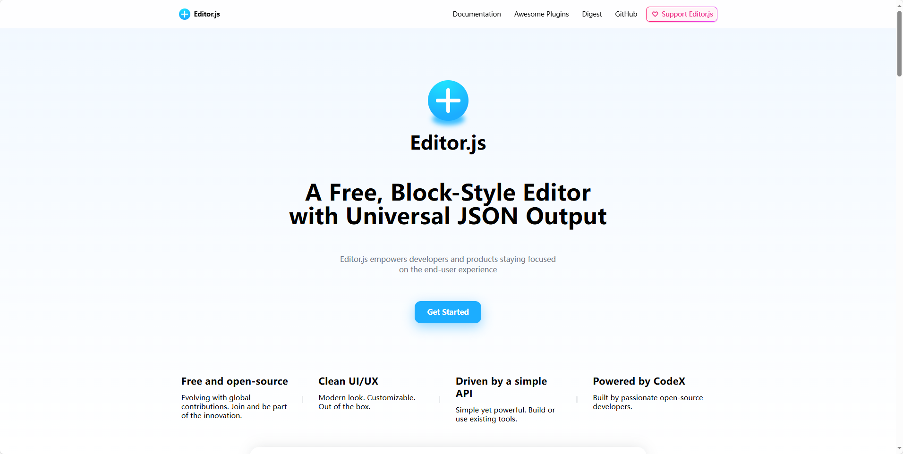

## [Editor.js](https://github.com/codex-team/editor.js)

Editor.js 是一个块风格的编辑器。块是组成条目的结构单元。例如，段落，标题，图像，视频，列表都是块。每个块由插件表示。此外，Editor.js 还为开发者提供了许多现成的插件和一个用于创建新插件的简单 API。

地址：https://github.com/codex-team/editor.js

