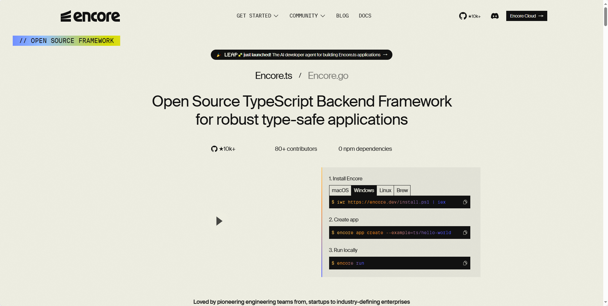
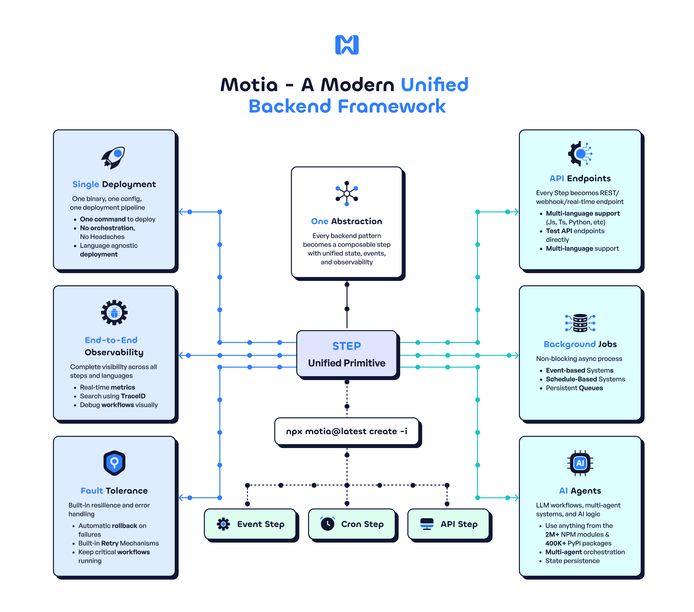

## [Encore](https://encore.dev/)

Encore.ts 是一款面向 TypeScript 的新型后端框架，号称在性能上比 Express.js 快 9 倍，并比 Bun（配合 Zod 验证）快 3 倍。本文将从性能数据、架构设计、团队效率提升、实战场景、生态现状等方面，对 Encore.ts 进行全面的技术分析，并分享相关的开发实践经验。

地址：https://encore.dev/

## [Motia](https://github.com/MotiaDev/motia)

这是一款一站式后端后框架，集成了 API、事件驱动、定时任务、实时数据流和 AI Agent 等能力，支持 TypeScript、Python 等多语言混合开发。它内置状态管理、结构化日志、端到端链路追踪与可视化调试器（Workbench），支持流程图、日志流和实时测试等功能。

地址：https://github.com/MotiaDev/motia